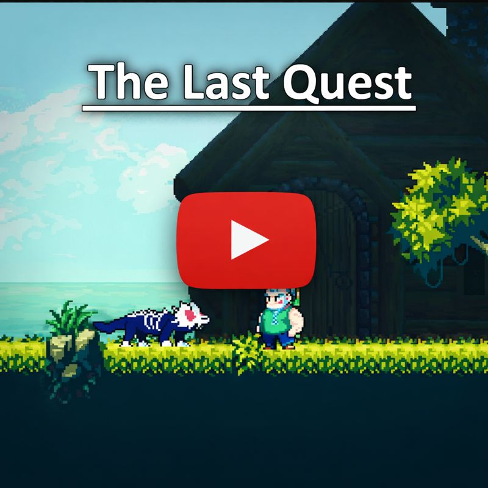

# The Last Quest

**The Last Quest** is a story-driven 2D action platformer developed in **Godot Engine** as part of a game jam.

You play as a retired hero who abandoned his life of battle long ago. When a lone king arrives, speaking of a cursed castle filled with monsters—and offering something impossible to ignore—you are forced to confront your past and step back into darkness.

This journey is not just about combat, but about loss, redemption, and the light that still survives in broken souls.

---

## 🎮 Gameplay Preview

---

## ⚔️ Features
- Story-driven 2D action platformer gameplay  
- Responsive movement and combat mechanics  
- Enemy encounters inside a cursed castle  
- Narrative focused on redemption and loss  
- Atmospheric pixel-art environments  

---

## 🎮 Controls
- **Move Left:** A / J  
- **Move Right:** D / L  
- **Jump:** Space  
- **Attack:** Tab or `-` (Minus key)  
- **Interact / Dialogue:** E or Q  

---

## 🧪 Project Status
> **Note:** This project was developed for a game jam and completed within 5 days.  
> Due to time constraints, some areas may feel unpolished or incomplete.  
> The project is stable and serves as a foundation for future improvements.

---

## 🔧 Tech Stack
- **Engine:** Godot  
- **Language:** GDScript  
- **Platform:** Windows / Web  

---

## 👥 Contributors & Credits
- **Priyansh Singh** — Game Programming, Core Mechanics, Systems Design  
